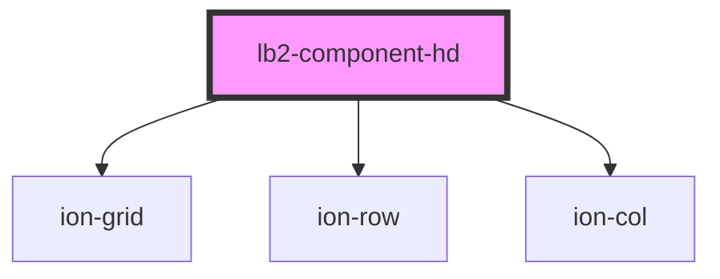

# lb2-component2

<!-- Auto Generated Below -->

## Properties

| Property   | Attribute   | Description | Type     | Default     |
| ---------- | ----------- | ----------- | -------- | ----------- |
| `break`    | `break`     |             | `number` | `0`         |
| `image`    | `image`     |             | `string` | `undefined` |
| `lung`     | `lung`      |             | `number` | `0`         |
| `maxValue` | `max-value` |             | `number` | `undefined` |
| `name`     | `name`      |             | `string` | `undefined` |
| `value`    | `value`     |             | `number` | `undefined` |

## Dependencies

### Depends on

- ion-grid
- ion-row
- ion-col

### Graph

----------------------------------------------

*Built with [StencilJS](https://stenciljs.com/)*
